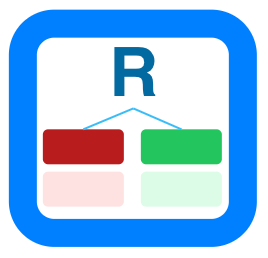
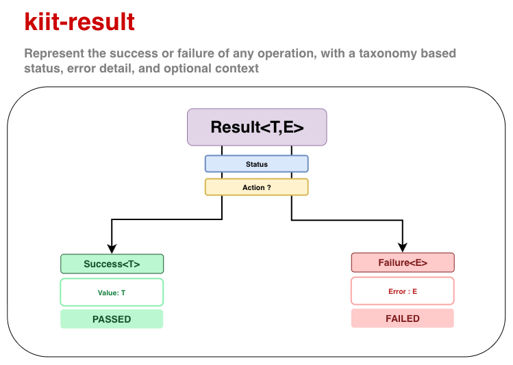

<div align="center">
<h1>
  
</h1>

# kiit-result

**A Kotlin `Result<T, E>` type built on kiit-codes' status taxonomy.**

A type for representing the result of an operation, capturing either a success or failure with a value or error details, with optional support for a taxonomy of status codes.

[](https://central.sonatype.com/artifact/dev.kiit/kiit-result)
[](https://github.com/kiitdev/kiit-result/actions/workflows/ci.yml)
[](./LICENSE)
[](https://kotlinlang.org)

Part of [Kiit](https://www.kiit.dev) · [Docs](https://www.kiit.dev/result) · [Blog](#)

</div>



## 📚 Table of Contents

| # | | Topic | Description |
|---:|:---:|---|---|
| 1 | 💡 | [Why](#why) | Problems kiit-result is designed to solve |
| 2 | 🚀 | [Start](#start) | Installation and a quick example |
| 3 | 🧠 | [Concepts](#concepts) | `Result`/`Success`/`Failure`, `Action`, and the type aliases |
| 4 | 🏗️ | [Builders](#builders) | Status-aware factory methods for building a `Result` |
| 5 | 🔁 | [Conversions](#conversions) | Converting between `Outcome`, `Try`, and exceptions |
| 6 | ⚙️ | [Usage](#usage) | Use cases, and when (not) to reach for this |
| 7 | 🗺️ | [Roadmap](#roadmap) | Planned improvements and future work |
| 8 | 📖 | [Learn More](#learn-more) | Deeper documentation and design topics |
| 9 | ❓ | [FAQ](#faq) | Design rationale, comparisons, adoption, and maturity |
| 10 | 📋 | [Requirements](#requirements) | Platforms and dependencies |
| 11 | 🤝 | [Contributing](#contributing) | Build, test, and contribute |
| 12 | 📄 | [License](#license) | Apache 2.0 license |

## Why

Returning `null` for "not found" loses the reason. Throwing for expected, recoverable failures (validation, a conflict, an unauthorized caller) is expensive and easy to over- or under-catch. And once you *do* return a status/error pair by convention, every caller ends up re-deriving the same success/failure branching logic by hand.

**kiit-result is a `Result<T, E>` that composes the usual monadic operations with kiit-codes' closed status taxonomy**, instead of a bespoke or numeric status of its own. `Success` carries a [kiit-codes](https://github.com/kiitdev/kiit-codes) `Passed` status (`Succeeded`, `Pending`, `Excluded`, `Information`); `Failure` carries a `Failed` status (`Restricted`, `Invalid`, `Rejected`, `Unserved`). Builders map each common case to its matching category, so `restricted()` gives you `Restricted.DENIED`, `invalid()` gives you `Invalid.INVALID_VALUE`, and so on — without hand-rolling a status object at every call site.

Modeling an operation this way means answering four separable questions, not one:

1. **Did it work?** — `Success<T>` or `Failure<E>`.
2. **What kind of outcome was it?** — `status: Status`, a closed taxonomy from kiit-codes (`Succeeded`, `Restricted`, `Invalid`, `Rejected`, ...).
3. **What went wrong, specifically?** — the `Failure` branch's `error: E`, most commonly kiit-codes' `Err`, carrying per-instance detail a fixed status can't.
4. **What was being done, and under what circumstances?** — an optional `action: Action?`, naming the operation and any correlation id/attributes, attached via `withAction`.

It builds directly on kiit-codes rather than reimplementing status classification:

1. **A monadic `Result<T, E>`** — `map`, `flatMap`/`then`, `fold`, `onSuccess`/`onFailure`, `getOrElse`, and friends, so success/failure handling composes without manual `if`/`else` branching.
2. **A flexible error type** — the `Failure` branch's error type `E` can be anything: `String`, `Throwable`, [kiit-codes](https://github.com/kiitdev/kiit-codes)' `Err`, or your own domain type. Type aliases (`Try<T>`, `Option<T>`, `Outcome<T>`) cover the common cases.
3. **Status-aware builders** — `restricted`/`invalid`/`rejected`/`unserved`/`excluded` build a `Result` pre-populated with the matching kiit-codes status category, so you rarely construct `Success`/`Failure` by hand.

```kotlin
val outcome: Outcome<User> = userService.create("alice", "alice@example.com")
outcome.fold(
    { user -> println("created ${user.id}") },
    { err -> println("failed: ${err.message} (${outcome.status.name})") },
)
```

## Start

**Gradle (Kotlin DSL):**

```kotlin
dependencies {
    implementation("dev.kiit:kiit-result:1.0.1")
}
```

`kiit-result` depends on `dev.kiit:kiit-codes` transitively — you don't need to add it separately.

**Return an `Outcome<T>` (`Result<T, Err>`) using the builder methods:**

```kotlin
import kiit.codes.Invalid
import kiit.codes.Rejected
import kiit.result.Outcome
import kiit.result.OutcomeBuilder

class UserService : OutcomeBuilder {
    private val users = mutableMapOf<String, User>()

    fun create(id: String, email: String): Outcome<User> {
        if (email.isBlank()) return invalid(Invalid.BAD_REQUEST)
        if (users.containsKey(id)) return rejected(Rejected.CONFLICT)
        val user = User(id, email)
        users[id] = user
        return success(user)
    }
}
```

**Compose with `map`/`flatMap`/`fold`:**

```kotlin
import kiit.result.flatMap

userService.create("alice", "alice@example.com")
    .map { it.email }
    .onSuccess { println("registered: $it") }
    .onFailure { err -> println("could not register: ${err.message}") }
```

**Convert to a `Try<T>` to cross an exception-only boundary:**

```kotlin
// Wraps a Failure<Err> into a Failure<StatusException> from kiit-codes
val asTry = userService.fetch("missing").toTry()
asTry.onFailure { ex -> println("caught: ${ex.message}") }
```

See [`samples/sample-kotlin`](./samples/sample-kotlin) for a runnable end-to-end Kotlin example, or
[`samples/sample-java`](./samples/sample-java) for the same library used from plain Java.

**Swift:** not yet distributed via SPM/XCFramework (the framework is `.framework`-only today,
built locally). Companion-less members like `Outcomes`/`Options`/`Tries` get clean `.shared`
access out of the box, and this module uses [SKIE](https://skie.touchlab.co/) for real,
compiler-enforced Swift exhaustiveness over `Success`/`Failure` — a genuinely **flat** switch,
simpler than kiit-codes' nested `Status` case, since `Result<T, E>` is only one sealed level deep:

```swift
import KiitResult

let result = Success(value: KotlinInt(value: 42))

func describe<T, E>(_ r: Result<T, E>) -> String {
    switch onEnum(of: r) {
    case .success(let s): return "ok: \(String(describing: s.value))"
    case .failure(let f): return "err: \(String(describing: f.error))"
    }
}
```

Generic type params require `AnyObject` (box `Int`/`String` as `KotlinInt`/`NSString`), and
Kotlin's `Nothing` doesn't widen to a concrete error type in Swift — see
[`samples/sample-swift`](./samples/sample-swift) for the full, verified-working subset and exactly
what does and doesn't work (including a confirmed-broken case: `flatMap` can't be used from Swift
to construct new results).

## Concepts

```
Result<T, E> = Success<T> | Failure<E>

Success<T>.status : Passed    (from kiit-codes)
Failure<E>.status : Failed    (from kiit-codes)
Result<T, E>.action : Action? (optional, both branches)
```

| Term | What it is |
|---|---|
| **`Result<T, E>`** | Sealed type, either `Success<T>` or `Failure<E>`. |
| **`Success<T>`** | Holds a `value: T` and a `status: Passed`. Defaults to `Succeeded.SUCCESS`. |
| **`Failure<E>`** | Holds an `error: E` and a `status: Failed`. Defaults to `Unserved.UNEXPECTED`. |
| **`Action`** | Optional context for the operation that produced/wrapped a `Result` — `action: String`, `xid: String? = null`, `data: Map<String, String> = mapOf()`, `previous: Action? = null`. Attach via `withAction(action, chain = true)`; chains to any existing `Action` by default, useful for pinpointing which layer failed in nested operations. |
| **`message`** | `result.status.message` — a convenience accessor on every `Result`. |
| **`Option<T>`** | `Result<T, Unit>` — the historical role of `Option`/`Maybe` (Rust/Scala/Arrow), reimagined on `Result` so absence carries a `status` explaining why, not just a bare `None`. `Options.some(value)`/`Options.none()` are the discoverable entry points. |
| **`Try<T>`** | `Result<T, Throwable>` — exception as the error type. |
| **`Outcome<T>`** | `Result<T, Err>` — [kiit-codes](https://github.com/kiitdev/kiit-codes)' `Err` as the error type; the most commonly used alias. |
| **`Validated<T>`** | `Result<T, Err.ErrorList>` — for validation, collecting multiple errors. |

Composition operators mirror what you'd expect from `Result`/`Either` in other languages: `map`, `mapError`, `flatMap`/`then`, `fold`, `exists`, `getOrNull`, `getOrElse`, `onSuccess`, `onFailure`, `transform`, `contains`, `inner` (flattens a nested `Result`), plus `or`/`and`/`operate` for combining two `Result`s, and `withStatus`/`withAction` for attaching a status/operation context after construction. Once attached, `action` survives `map`/`mapError`/`toOutcome()`/`toTry()`, the same as `status` does.

## Builders

`Builder<E>` provides status-aware factory methods so you rarely build `Success`/`Failure` directly. It's composed from two smaller interfaces, one per branch, so each stays scoped to its own category constants (the same reason kiit-codes keeps `Succeeded`/`Restricted`/etc. constants on their own companions rather than one shared object):

- **`PassedBuilder<E>`** — `success`/`pending`/`excluded`/`information`, each with 3 overloads: no-arg, `(value, message: String? = null)`, and `(value, status)`.
- **`FailedBuilder<E>`** — `restricted`/`invalid`/`rejected`/`unserved`, each with 5 overloads: no-arg, `(message)`, `(ex, status?)`, `(err, status?)`, `(status)`.

`Builder`/`PassedBuilder`/`FailedBuilder` live in `kiit.result.builders` — they're the extensible machinery you implement (directly, or via `Outcomes`/`Options`/`Tries`), not something most callers import directly. `Outcomes`/`Options`/`Tries`/`Validations` themselves stay in `kiit.result`, alongside `Result`/`Success`/`Failure`, since those are the ready-made, everyday API.

| Builder | Status group | Default |
|---|---|---|
| `success(value)` | `Passed.Succeeded` | `Succeeded.SUCCESS` |
| `pending(value)` | `Passed.Pending` | `Pending.ACCEPTED` |
| `excluded(value)` | `Passed.Excluded` | `Excluded.OMITTED` |
| `information(value)` | `Passed.Information` | `Information.NOTICE` |
| `restricted(...)` | `Failed.Restricted` | `Restricted.DENIED` |
| `invalid(...)` | `Failed.Invalid` | `Invalid.INVALID_VALUE` |
| `rejected(...)` | `Failed.Rejected` | `Rejected.RULE_VIOLATION` |
| `unserved(...)` | `Failed.Unserved` | `Unserved.UNEXPECTED` |

Note that `excluded()` builds a **`Success`**, not a `Failure` — an intentionally excluded item (deduplicated, disqualified, filtered out) is a [kiit-codes](https://github.com/kiitdev/kiit-codes) `Passed.Excluded` status, not a failure. There's no separate `conflict()` — it's `rejected(status = Rejected.CONFLICT)`, since a conflict is just a specific `Rejected` outcome, not its own category.

`Options` also adds `some(value)`/`none(...)` on top of the generic builders above — a discoverable `Some`/`None`-style pair for `Option<T>` specifically (see [Concepts](#concepts)). `none()` defaults to `Rejected.NOT_EXISTS`, distinct from the generic `Unserved.UNEXPECTED` fallback:

```kotlin
import kiit.result.Options

val a = Options.some(42)                    // Option<Int> — present
val b = Options.none<Int>()                 // Option<Int> — absent, Rejected.NOT_EXISTS
val c = Options.none<Int>(Rejected.CONFLICT) // Option<Int> — absent, custom status
```

`Outcomes`/`Options`/`Tries` are the three ready-made `Builder` implementations, one per common error type. `Validations` is a fourth, purpose-built for collecting multiple errors at once instead of catching an exception:

```kotlin
import kiit.result.Outcomes
import kiit.result.Options
import kiit.result.Tries
import kiit.result.Validations

val a = Outcomes.attempt { riskyCall() }        // Outcome<T>    — catches Throwable, wraps as Err
val b = Options.of { riskyCall() }              // Option<T>     — catches Throwable, discards detail
val c = Tries.attempt { riskyCall() }           // Try<T>        — catches Throwable, re-derives status
                                                  //                 from a thrown kiit-codes StatusException
val d = Validations.of(form, errorsFound)       // Validated<T>  — Success if errorsFound is empty,
                                                  //                 otherwise a single Failure carrying all of them
```

## Conversions

- **`toOutcome()`** — converts any `Result<T, E>` to `Outcome<T>` (`Result<T, Err>`), building an `Err` from whatever the failure held (`String`, `Exception`, or an existing `Err`).
- **`toTry()`** — converts any `Result<T, E>` to `Try<T>` (`Result<T, Throwable>`). An `Err`-typed failure becomes a [kiit-codes](https://github.com/kiitdev/kiit-codes) `StatusException` via `Failed.toException(errors)`, so the exception still carries the original status and error detail.
- **`Tries.of { ... }`** — the reverse direction: if the block throws a `StatusException` (`RestrictedException`/`InvalidException`/`RejectedException`/`UnservedException`), the resulting `Try` is built with the matching `restricted`/`invalid`/`rejected`/`unserved` status instead of a generic failure.

## Usage

1. **Service layers** — return `Outcome<T>` instead of throwing for expected failures.
2. **Pipelines** — `map`/`flatMap` chains compose without manual null/exception checks at each step.
3. **Validation** — `Validated<T>` (`Result<T, Err.ErrorList>`) collects multiple errors via `Validations`.
4. **Exception boundaries** — `toTry()`/`Tries.of` interop with `StatusException` when a caller only understands exceptions.
5. **HTTP/gRPC responses** — `result.status` converts via kiit-codes' `CodesToHttp`/`CodesToGrpc`.

**Good fit if:**
1. You want explicit, monadic return values instead of throw/catch for expected failures.
2. You're already using (or want) kiit-codes' status taxonomy and want a `Result` type layered on top of it, instead of a bespoke one.
3. You need to compose several fallible steps (`map`/`flatMap`) without nested `try`/`catch`.

**Probably not necessary if:**
1. Exceptions already communicate everything you need, and you don't want the monadic-return-value style.
2. You only need status classification, not a `Result` wrapper — in which case see [kiit-codes](https://github.com/kiitdev/kiit-codes) on its own.

## Roadmap

kiit-result has been extracted from kiit framework and polished as a standalone module.
This has been used in production for over 4+ years to power mobile and server kotlin applications.
Current work is focused on the Kotlin release, documentation, examples, and ecosystem integration.

| # | Topic | Description |
|---:|---|---|
| 1 | **npm publish** | Publish pipeline for JS consumers (`@kiit/result`). |
| 2 | **SPM / XCFramework** | Distribution for Swift consumers — SKIE is already applied for real Swift exhaustiveness (see Start above and `samples/sample-swift`), but the actual `.xcframework` + SPM package, published to `kiit-spm`, is still unbuilt. |
| 3 | **`Raise<E>`-style DSL** | A flat, non-nested alternative to `.then { }` chaining for multi-step composition (`result { }` + `.bind()`) — needs Kotlin context parameters, experimental as of 2.3.x and reaching Stable in 2.4.0. |

See [GitHub Issues](https://github.com/kiitdev/kiit-result/issues) for current work and discussions.

## Learn More

| # | Topic | Description |
|---:|---|---|
| 1 | **Concepts** | Explore `Result`/`Success`/`Failure`, `Action`, and every type alias in depth. [Read the concepts docs](https://www.kiit.dev/docs/result/concepts). |
| 2 | **Builders** | Learn how the status-aware builders work and how to implement your own `Builder<E>`. [Read the builders docs](https://www.kiit.dev/docs/result/builders). |
| 3 | **Conversions** | See every conversion between `Result`, `Outcome`, `Try`, and kiit-codes' `StatusException`. [Read the conversions docs](https://www.kiit.dev/docs/result/conversions). |
| 4 | **Validation** | Learn how `Validated<T>` and `Validations` accumulate multiple errors instead of stopping at the first. [Read the validation docs](https://www.kiit.dev/docs/result/validation). |
| 5 | **Codes** | See the separate `kiit-codes` module this library builds its status taxonomy on top of. [Read the kiit-codes docs](https://www.kiit.dev/docs/codes). |

## FAQ

| Question | Answer |
|---|---|
| **Philosophy & Design** | |
| Why not just use Arrow's `Either`/`Validated` or kotlin-result? | Those give you a monad with zero built-in taxonomy — you supply the meaning yourself. kiit-result is the same kind of monad fused to kiit-codes' taxonomy, so you get consistency across a codebase without every team inventing its own status vocabulary. A different bet, not a "better generic Result." |
| Why does `Success` carry a status too, not just `Failure`? | Most Result types treat success as inert — just a value. Here `Success.status: Passed` distinguishes "succeeded," "succeeded but pending," and "succeeded but excluded" instead of flattening them all to `true`. |
| Why is `E` still fully generic instead of locked to kiit-codes' `Err`? | So `Try<T>`, `Option<T>`, `Outcome<T>`, and `Validated<T>` can all share one `Result<T, E>` rather than needing separate types. The cost is nothing ties `Failure.status` to `Failure.error` at compile time — deliberately accepted, not fixed. |
| Doesn't decoupling `status` from `error` risk them disagreeing? | Yes, narrowly — only if you bypass the builders or explicitly override `status` against an unrelated `error`. The ergonomic path (`restricted(err)`, etc.) already pairs them correctly by default. |
| Why two ways to build a value (constructor vs. `Builder<E>`) instead of one? | They serve different situations: the constructor is for no-ceremony construction with no `Builder` in scope; `Builder<E>` is the status-aware convenience path when implementing `Outcomes`/`Options`/`Tries` or your own class. |
| **Comparisons & Alternatives** | |
| How is this different from Kotlin's own `kotlin.Result`? | stdlib `Result` has one type param and always uses `Throwable` as the error; it isn't a sealed hierarchy meant for pattern matching. kiit-result is a real two-branch sealed type with a flexible error type and a status on both branches. |
| Isn't `Option<T> = Result<T, Unit>` a strange use of the name "Option"? | It's a deliberate lineage, not a misuse — the same historical role as Rust/Scala/Arrow's `Option` (standing in for a nullable value), reimagined so absence carries a `status` explaining why instead of a bare `None`. `Options.some(value)`/`Options.none()` make that explicit. |
| Is this tied to HTTP or web APIs? | No — it's a universal classification usable at any layer (service call, job step, CLI command), validated against HTTP and gRPC as an external sanity check, not derived from either. |
| **API & Design Details** | |
| Why is there no `conflict()` builder? | It was just `rejected()` with `Rejected.CONFLICT` as the default status — not its own category. Use `rejected(status = Rejected.CONFLICT)`. |
| Why did `denied`/`ignored` become `restricted`/`excluded`? | To match kiit-codes' actual group names (`Restricted`, `Excluded`) instead of carrying forward older, inconsistent naming. |
| Why does `excluded()` build a `Success`, not a `Failure`? | `Excluded` is a `Passed` group in kiit-codes — an intentionally skipped/deduplicated/disqualified item isn't a failure. |
| Why is `Builder<E>` split into `PassedBuilder`/`FailedBuilder`? | Keeps each interface's surface scoped to one branch — the same reason kiit-codes keeps each group's constants on its own companion rather than one shared object. |
| Do I have to pick a specific `Status` every time I use a builder? | No — the group builders (`restricted`, `invalid`, `rejected`, `unserved`, and `pending`/`excluded`/`information` on the success side) all apply a sensible default when you don't supply one. You only reach for an explicit status when the default doesn't fit (`restricted(status = Restricted.LOCKED)`) — routine use never requires touching `Status` directly. |
| Whatever happened to the numeric status code? | Dropped, mirroring kiit-codes' own removal — an earlier version had one and it invited the wrong inference (looks like an HTTP code, isn't). Get a protocol code on demand via `CodesToHttp`/`CodesToGrpc`. |
| **Adoption in Practice** | |
| Can I use my own error type and ignore kiit-codes? | Only partially — `E` is generic (use `Throwable`, `String`, your own type), but `Success.status`/`Failure.status` are hard-typed to kiit-codes' `Passed`/`Failed`. There's no way to use `Result<T, E>` without a kiit-codes status on every branch. |
| What if my team already has its own status conventions? | Not an overnight replacement — existing statuses can map into the taxonomy incrementally. |
| Does this actually work on JS and iOS today? | Worth being precise here: kiit-result's production history is JVM/Android — JS and iOS/Swift are new targets with no production history yet, not just "unexercised" versions of something proven. JS/TS is a deliberately **partial** pass — `Result`/`Success`/`Failure`/`Action`/the builder interfaces are `@JsExport`ed, but it's not CI-gated or published to npm (see `samples/sample-ts`), since TypeScript can't compiler-enforce exhaustiveness the way Kotlin/Java/Swift can. iOS uses [SKIE](https://skie.touchlab.co/) for real, compiler-enforced Swift exhaustiveness (see `samples/sample-swift`) — a materially better story than JS here, including plain Kotlin `object`s (`Outcomes`/`Options`/`Tries`) getting clean `.shared` access with no extra work, unlike JS. |
| **The AI Angle** | |
| Is the "built for AI" angle just marketing? | Same answer as kiit-codes gives, extended to the `Result` layer: the design choices are justified on ordinary engineering grounds first — exhaustive branching, a small fixed vocabulary, fewer decisions per call site. AI tooling benefits from the same properties any consistent codebase does, but the library stands on its own without that framing. |
| What's the actual theory? | A closed `Success`/`Failure` split with a fixed, named-category vocabulary (`restricted`/`invalid`/`rejected`/`unserved`/`excluded`) gives an AI generating or reading code a small, predictable set of shapes to reach for, instead of guessing at ad hoc exception types or boolean flags per call site — and Kotlin's compiler-enforced exhaustive `when` over `Success`/`Failure` means a branch can't be silently missed, by a human or a model. Better accuracy, searchability, and standardization across a codebase are the claimed benefits — not proven, and intentionally modest about that, same as kiit-codes. |
| **Maturity & Trust** | |
| Is this production-ready at 1.0.0? | The version reflects the *standalone repo's* age, not the design's — this `Result<T, E>` pattern, paired with a status taxonomy, has been running in production for years across both mobile and server applications inside the original kiit framework. What's actually new: extraction into an independent repo, decoupled from the kiit monorepo; an updated and polished taxonomy in kiit-codes; and `kiit-codes`/`kiit-result` now being fully decoupled from each other where they were previously coupled in one module. The multiplatform export work is the one piece that's genuinely in progress, not battle-tested. |
| What about single-maintainer risk? | Real, worth being upfront about — Apache 2.0, source available, no second maintainer or organizational backing yet. |

## Requirements

- Kotlin Multiplatform
- JVM, Android, JS (IR), iOS (arm64, simulator arm64, x64)
- Depends on `dev.kiit:kiit-codes` (transitively available to consumers via `api`)

## Contributing

Contributions and design feedback are welcome. See [BUILD.md](./BUILD.md) for build, test, and publish instructions.

## License

[Apache License 2.0](./LICENSE)

---

<div align="center">

**kiit-result** is one module of [Kiit](https://www.kiit.dev) — a lightweight, modular Kotlin framework for building server applications, APIs, CLIs, and jobs.

**Adopt one module at a time.**

</div>
