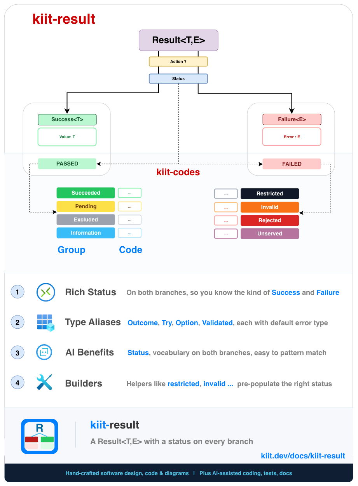
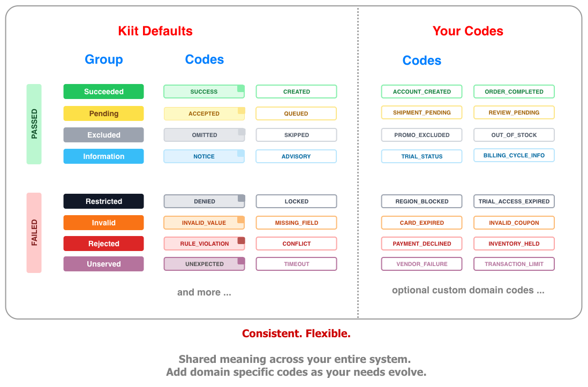
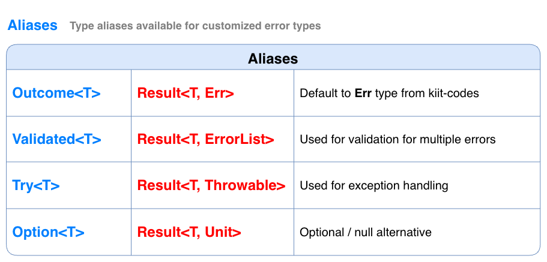

<div align="center">
<h1>
  
</h1>

**A Kotlin `Result<T, E>` type with a kiit-codes status on every branch, not just failure.**

`Success` holds a value, `Failure` holds an error, and either can carry an `Action` recording which operation produced it, useful for tracing across nested or chained calls.

[](https://central.sonatype.com/artifact/dev.kiit/kiit-result)
[](https://github.com/kiitdev/kiit-result/actions/workflows/ci.yml)
[](./LICENSE)
[](https://kotlinlang.org)

Part of [Kiit](https://www.kiit.dev) · [Docs](https://www.kiit.dev/docs/kiit-result)

</div>



## 📚 Table of Contents

| # | | Topic | Description |
|---:|:---:|---|---|
| 1 | 💡 | [Why](#why) | Problems kiit-result is designed to solve |
| 2 | 🚀 | [Start](#start) | Installation and a quick example |
| 3 | 🧠 | [Concepts](#concepts) | `Result`/`Success`/`Failure`, `Action`, and the type aliases |
| 4 | 🏗️ | [Builders](#builders) | Status-aware factory methods for building a `Result` |
| 5 | 🔁 | [Conversions](#conversions) | Converting between `Outcome`, `Try`, and exceptions |
| 6 | ⚙️ | [Usage](#usage) | Use cases, and when (not) to reach for this |
| 7 | 🗺️ | [Roadmap](#roadmap) | Planned improvements and future work |
| 8 | 📖 | [Learn More](#learn-more) | Deeper documentation, design rationale, and FAQ on kiit.dev |
| 9 | 📋 | [Requirements](#requirements) | Platforms and dependencies |
| 10 | 🤝 | [Contributing](#contributing) | Build, test, and contribute |
| 11 | 📄 | [License](#license) | Apache 2.0 license |

## Why

Returning `null` for "not found" loses the reason. Throwing for expected, recoverable failures (validation, a conflict, an unauthorized caller) is expensive and easy to over- or under-catch. And once you *do* return a status/error pair by convention, every caller ends up re-deriving the same success/failure branching logic by hand.

**kiit-result is a `Result<T, E>` that composes the usual monadic operations with kiit-codes' closed status taxonomy**, instead of a bespoke or numeric status of its own. `Success` carries a [kiit-codes](https://github.com/kiitdev/kiit-codes) `Passed` status (`Succeeded`, `Pending`, `Excluded`, `Information`); `Failure` carries a `Failed` status (`Restricted`, `Invalid`, `Rejected`, `Unserved`). Builders map each common case to its matching category, so `restricted()` gives you `Restricted.DENIED`, `invalid()` gives you `Invalid.INVALID_VALUE`, and so on — without hand-rolling a status object at every call site.

Modeling an operation this way means answering four separable questions, not one:

1. **Did it work?** — `Success<T>` or `Failure<E>`.
2. **What kind of outcome was it?** — `status: Status`, a closed taxonomy from kiit-codes (`Succeeded`, `Restricted`, `Invalid`, `Rejected`, ...).
3. **What went wrong, specifically?** — the `Failure` branch's `error: E`, most commonly kiit-codes' `Err`, carrying per-instance detail a fixed status can't.
4. **What was being done, and under what circumstances?** — an optional `action: Action?`, naming the operation and any correlation id/attributes, attached via `withAction`.

It builds directly on kiit-codes rather than reimplementing status classification:

1. **A monadic `Result<T, E>`** — `map`, `flatMap`/`then`, `fold`, `onSuccess`/`onFailure`, `getOrElse`, and friends, so success/failure handling composes without manual `if`/`else` branching.
2. **A flexible error type** — the `Failure` branch's error type `E` can be anything: `String`, `Throwable`, [kiit-codes](https://github.com/kiitdev/kiit-codes)' `Err`, or your own domain type. Type aliases (`Try<T>`, `Option<T>`, `Outcome<T>`) cover the common cases.
3. **Status-aware builders** — `restricted`/`invalid`/`rejected`/`unserved`/`excluded` build a `Result` pre-populated with the matching kiit-codes status category, so you rarely construct `Success`/`Failure` by hand.

```kotlin
val outcome: Outcome<User> = userService.create("alice", "alice@example.com")
outcome.fold(
    { user -> println("created ${user.id}") },
    { err -> println("failed: ${err.message} (${outcome.status.name})") },
)
```

## Start

**Gradle (Kotlin DSL):**

```kotlin
dependencies {
    implementation("dev.kiit:kiit-result:1.0.1")
}
```

`kiit-result` depends on `dev.kiit:kiit-codes` transitively — you don't need to add it separately.

**Return an `Outcome<T>` (`Result<T, Err>`) using the builder methods:**

```kotlin
import kiit.codes.Invalid
import kiit.codes.Rejected
import kiit.result.Outcome
import kiit.result.Outcomes

class UserService {
    private val users = mutableMapOf<String, User>()

    fun create(id: String, email: String): Outcome<User> {
        if (email.isBlank()) return Outcomes.invalid(Invalid.BAD_REQUEST)
        if (users.containsKey(id)) return Outcomes.rejected(Rejected.CONFLICT)
        val user = User(id, email)
        users[id] = user
        return Outcomes.success(user)
    }
}
```

**Compose with `map`/`flatMap`/`fold`:**

```kotlin
userService.create("alice", "alice@example.com")
    .map { it.email }
    .onSuccess { println("registered: $it") }
    .onFailure { err -> println("could not register: ${err.message}") }
```

**Convert to a `Try<T>` to cross an exception-only boundary:**

```kotlin
// Wraps a Failure<Err> into a Failure<StatusException> from kiit-codes
val asTry = userService.fetch("missing").toTry()
asTry.onFailure { ex -> println("caught: ${ex.message}") }
```

See [`samples/sample-kotlin`](./samples/sample-kotlin) for a runnable end-to-end Kotlin example, or
[`samples/sample-java`](./samples/sample-java) for the same library used from plain Java.

**Swift:** not yet distributed via SPM/XCFramework, but [SKIE](https://skie.touchlab.co/) already
gives real, compiler-enforced Swift exhaustiveness over `Success`/`Failure`. See
[`samples/sample-swift`](./samples/sample-swift) for a runnable example, or the
[Swift Interop guide](https://www.kiit.dev/docs/kiit-result#swift-interop) for the full picture,
including what doesn't work yet.

## Concepts

```
Result<T, E> = Success<T> | Failure<E>

Success<T>.status : Passed    (from kiit-codes)
Failure<E>.status : Failed    (from kiit-codes)
Result<T, E>.action : Action? (optional, both branches)
```

| Term | What it is |
|---|---|
| **`Result<T, E>`** | Sealed type, either `Success<T>` or `Failure<E>`. |
| **`Success<T>`** | Holds a `value: T` and a `status: Passed`. Defaults to `Succeeded.SUCCESS`. |
| **`Failure<E>`** | Holds an `error: E` and a `status: Failed`. Defaults to `Unserved.UNEXPECTED`. |
| **`Action`** | Optional context for the operation that produced/wrapped a `Result`. Attach via `withAction(action, chain = true)`. |
| **`message`** | `result.status.message` — a convenience accessor on every `Result`. |

Every `Result` carries a `status` from kiit-codes' own taxonomy, not just `Failure`: `Passed` (`Succeeded`, `Pending`, `Excluded`, `Information`) or `Failed` (`Restricted`, `Invalid`, `Rejected`, `Unserved`). See the [kiit-codes docs](https://www.kiit.dev/docs/kiit-codes#taxonomy) for the full set of groups and codes.



`Option<T>`, `Try<T>`, `Outcome<T>`, and `Validated<T>` are type aliases fixing `E` for common cases, each with a matching builder already wired up:

| Alias | Definition | Role |
|---|---|---|
| **`Outcome<T>`** | `Result<T, Err>` | [kiit-codes](https://github.com/kiitdev/kiit-codes)' `Err` as the error type, the most commonly used alias. |
| **`Validated<T>`** | `Result<T, Err.ErrorList>` | For validation, collecting multiple errors instead of stopping at the first. |
| **`Try<T>`** | `Result<T, Throwable>` | Exception as the error type. |
| **`Option<T>`** | `Result<T, Unit>` | The historical `Option`/`Maybe` role, reimagined so absence carries a `status`. `Options.some(value)`/`Options.none()` are the entry points. |



Composition operators mirror what you'd expect from `Result`/`Either` in other languages — `map`, `flatMap`/`then`, `fold`, `getOrElse`, `recover`, and friends, plus `withStatus`/`withAction` for attaching a status/operation context after construction. See the [full operator reference](https://www.kiit.dev/docs/kiit-result#operators) for the complete list.

A `List<Result<T, E>>` adds its own operators: `combine()` sequences the list into one `Result<List<T>, E>`, short-circuiting on the first `Failure`; `partition()` splits it into successes and errors; `allSuccess`/`allFailure`/`anySuccess`/`anyFailure` check the batch without building a new `Result`.

## Builders

`Builder<E>` provides status-aware factory methods so you rarely build `Success`/`Failure` directly. `Outcomes`/`Options`/`Tries`/`Validations` are the ready-made implementations, one per alias.

| Builder | Status group | Default |
|---|---|---|
| `success(value)` | `Passed.Succeeded` | `Succeeded.SUCCESS` |
| `pending(value)` | `Passed.Pending` | `Pending.ACCEPTED` |
| `excluded(value)` | `Passed.Excluded` | `Excluded.OMITTED` |
| `information(value)` | `Passed.Information` | `Information.NOTICE` |
| `restricted(...)` | `Failed.Restricted` | `Restricted.DENIED` |
| `invalid(...)` | `Failed.Invalid` | `Invalid.INVALID_VALUE` |
| `rejected(...)` | `Failed.Rejected` | `Rejected.RULE_VIOLATION` |
| `unserved(...)` | `Failed.Unserved` | `Unserved.UNEXPECTED` |

Note that `excluded()` builds a **`Success`**, not a `Failure` — an intentionally excluded item (deduplicated, disqualified, filtered out) is a [kiit-codes](https://github.com/kiitdev/kiit-codes) `Passed.Excluded` status, not a failure. There's no separate `conflict()` — it's `rejected(status = Rejected.CONFLICT)`, since a conflict is just a specific `Rejected` outcome, not its own category.

See the [Builders docs](https://www.kiit.dev/docs/kiit-result#builders) for the full `Builder<E>` architecture, `Options.some`/`none`, and worked examples for `Outcomes`/`Options`/`Tries`/`Validations`.

## Conversions

- **`toOutcome()`** — converts any `Result<T, E>` to `Outcome<T>` (`Result<T, Err>`), building an `Err` from whatever the failure held (`String`, `Exception`, or an existing `Err`).
- **`toTry()`** — converts any `Result<T, E>` to `Try<T>` (`Result<T, Throwable>`). An `Err`-typed failure becomes a [kiit-codes](https://github.com/kiitdev/kiit-codes) `StatusException` via `Failed.toException(errors)`, so the exception still carries the original status and error detail.
- **`Tries.of { ... }`** — the reverse direction: if the block throws a `StatusException` (`RestrictedException`/`InvalidException`/`RejectedException`/`UnservedException`), the resulting `Try` is built with the matching `restricted`/`invalid`/`rejected`/`unserved` status instead of a generic failure.

## Usage

1. **Service layers** — return `Outcome<T>` instead of throwing for expected failures.
2. **Pipelines** — `map`/`flatMap` chains compose without manual null/exception checks at each step.
3. **Validation** — `Validated<T>` (`Result<T, Err.ErrorList>`) collects multiple errors via `Validations`.
4. **Exception boundaries** — `toTry()`/`Tries.of` interop with `StatusException` when a caller only understands exceptions.
5. **HTTP/gRPC responses** — `result.status` converts via kiit-codes' `CodesToHttp`/`CodesToGrpc`.

**Good fit if:**
1. You want explicit, monadic return values instead of throw/catch for expected failures.
2. You're already using (or want) kiit-codes' status taxonomy and want a `Result` type layered on top of it, instead of a bespoke one.
3. You need to compose several fallible steps (`map`/`flatMap`) without nested `try`/`catch`.

**Probably not necessary if:**
1. Exceptions already communicate everything you need, and you don't want the monadic-return-value style.
2. You only need status classification, not a `Result` wrapper — in which case see [kiit-codes](https://github.com/kiitdev/kiit-codes) on its own.

## Roadmap

kiit-result has been extracted from the Kiit toolkit and polished as a standalone module.
This has been used in production for over 4+ years to power mobile and server kotlin applications.
Current work is focused on the Kotlin release, documentation, examples, and ecosystem integration.

| # | Topic | Description |
|---:|---|---|
| 1 | **npm publish** | Publish pipeline for JS consumers (`@kiit/result`). |
| 2 | **SPM / XCFramework** | Distribution for Swift consumers — SKIE is already applied for real Swift exhaustiveness (see Start above and `samples/sample-swift`), but the actual `.xcframework` + SPM package, published to `kiit-spm`, is still unbuilt. |
| 3 | **`Raise<E>`-style DSL** | A flat, non-nested alternative to `.then { }` chaining for multi-step composition (`result { }` + `.bind()`) — needs Kotlin context parameters, experimental as of 2.3.x and reaching Stable in 2.4.0. |

See [GitHub Issues](https://github.com/kiitdev/kiit-result/issues) for current work and discussions.

## Learn More

| # | Topic | Description |
|---:|---|---|
| 1 | **Concepts** | Explore `Result`/`Success`/`Failure`, `Action`, and every type alias in depth. [Read the concepts docs](https://www.kiit.dev/docs/kiit-result#concepts). |
| 2 | **Builders** | Learn how the status-aware builders work and how to implement your own `Builder<E>`. [Read the builders docs](https://www.kiit.dev/docs/kiit-result#builders). |
| 3 | **Conversions** | See every conversion between `Result`, `Outcome`, `Try`, and kiit-codes' `StatusException`. [Read the conversions docs](https://www.kiit.dev/docs/kiit-result#conversions). |
| 4 | **Validation** | Learn how `Validated<T>` and `Validations` accumulate multiple errors instead of stopping at the first. [Read the validation docs](https://www.kiit.dev/docs/kiit-result#alias-validatedt). |
| 5 | **Codes** | See the separate `kiit-codes` module this library builds its status taxonomy on top of. [Read the kiit-codes README](https://github.com/kiitdev/kiit-codes#readme). |
| 6 | **FAQ** | Answers to common questions about design, comparisons, adoption, the AI angle, and project maturity. [Read the FAQ](https://www.kiit.dev/docs/kiit-result#faq). |
| 7 | **Design** | Read more about the reasoning behind a status on both branches, a flexible error type, and where kiit-result fits relative to Arrow/kotlin-result. [Read the design docs](https://www.kiit.dev/docs/kiit-result#design). |

## Requirements

- Kotlin Multiplatform
- JVM, Android, JS (IR), iOS (arm64, simulator arm64, x64)
- Depends on `dev.kiit:kiit-codes` (transitively available to consumers via `api`)

## Contributing

Contributions and design feedback are welcome. See [BUILD.md](./BUILD.md) for build, test, and publish instructions.

## License

[Apache License 2.0](./LICENSE)

---

<div align="center">

**kiit-result** is one module of [Kiit](https://www.kiit.dev) — a lightweight, modular Kotlin toolkit for building server applications, APIs, CLIs, and jobs.

**Adopt one module at a time.**

</div>
